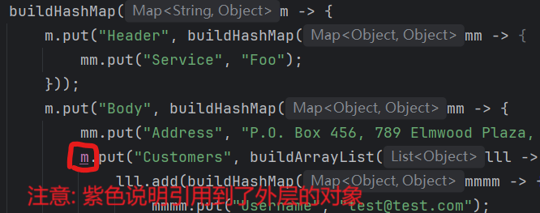

# `高可读性`的集合创建工具 LambdaBuilder/LambdaBuildable

> `HuTool/Guava`也提供了高可读性的集合创建能力, 但层级多的时候容易漏写build()方法 (会赋值一个"奇怪"的对象到Map里), 
> 为了写build()方法, 有时候括号也容易看不清. 但是`LambdaBuilder/LambdaBuildable`的Lambda表达式入参也容易搞错, 
> 总之各有优缺点, 详细对比见本文档末尾`与同类工具对比`.

### LambdaBuilder与LambdaBuildable

* **LambdaBuilder**: LambdaBuilder是一个工具类, 提供hashMap/arrayList等集合创建的静态方法
* **LambdaBuildable**: LambdaBuildable是一个接口类, 提供了buildHashMap/buildArrayList等default方法, 实现此接口的类可以直接调用方法, 省掉了`LambdaBuilder.`的书写.

> 文中LambdaBuilder只示范一次, 其他示例均使用LambdaBuildable. 这两种方式本质上一样, 只是一个像工具类一样调用LambdaBuilder静态方法, 一个直接调用接口的方法(不用写LambdaBuilder.).

### 假如要组装如下结构的Map

```
{
  "Header": {
    "Service": "Foo",
    "Time": "20250408",
    "Sequence": "202504080000357652"
  },
  "Body": {
    "Username": "test@test.com",
    "Orders": [
      {
        "Name": "Fish",
        "Quantity": "6",
        "UnitPrise": "68.8"
      },
      {
        "Name": "Milk",
        "Quantity": "3",
        "UnitPrise": "28.9"
      }
    ]
  }
}
```

### 使用LambdaBuilder组装

```
public class Test {
    public void process() {
        // P.S. Lambda表达式的入参根据层级命名为m(第一层) mm(第二层) mmm(第三层), 可读性好, 不容易弄错
        Map<String, Object> map = LambdaBuilder.HashMap(m -> {
            m.put("Header", LambdaBuilder.HashMap(mm -> {
                mm.put("Service", "Foo");
                mm.put("Time", "20250408");
                mm.put("Sequence", "202504080000357652");
            }));
            m.put("Body", LambdaBuilder.HashMap(mm -> {
                mm.put("Username", "test@test.com");
                mm.put("Orders", LambdaBuilder.ArrayList(lll -> {
                    lll.add(LambdaBuilder.HashMap(mmmm -> {
                        mmmm.put("Name", "Fish");
                        mmmm.put("Quantity", "6");
                        mmmm.put("UnitPrise", "68.8");
                    }));
                    lll.add(LambdaBuilder.HashMap(mmmm -> {
                        mmmm.put("Name", "Milk");
                        mmmm.put("Quantity", "3");
                        mmmm.put("UnitPrise", "28.9");
                    }));
                }));
            }));
        });
    }
}
```

### 使用LambdaBuildable组装

> LambdaBuildable是一个接口类, 提供了buildHashMap/buildArrayList等default方法, 实现此接口的类可以直接调用方法, 省掉了`LambdaBuilder.`的书写.

```
public class Test implements LambdaBuildable {
    public void process() {
        // P.S. Lambda表达式的入参根据层级命名为m(第一层) mm(第二层) mmm(第三层), 可读性好, 不容易弄错
        Map<String, Object> map = buildHashMap(m -> {
            m.put("Header", buildHashMap(mm -> {
                mm.put("Service", "Foo");
                mm.put("Time", "20250408");
                mm.put("Sequence", "202504080000357652");
            }));
            m.put("Body", buildHashMap(mm -> {
                mm.put("Username", "test@test.com");
                mm.put("Orders", buildArrayList(lll -> {
                    lll.add(buildHashMap(mmmm -> {
                        mmmm.put("Name", "Fish");
                        mmmm.put("Quantity", "6");
                        mmmm.put("UnitPrise", "68.8");
                    }));
                    lll.add(buildHashMap(mmmm -> {
                        mmmm.put("Name", "Milk");
                        mmmm.put("Quantity", "3");
                        mmmm.put("UnitPrise", "28.9");
                    }));
                }));
            }));
        });
    }
}
```

### 源Collection转List/Set

* 如果示例中的列表'Orders'数据源自一个List, 可以简化书写:

```
public class Test implements LambdaBuildable {
    public void process() {
        // sourceDataOrders为源数据
        List<Map<String, Object>> sourceDataOrders = ...源数据...
        
        // P.S. Lambda表达式的入参根据层级命名为m(第一层) mm(第二层) mmm(第三层), 可读性好, 不容易弄错
        Map<String, Object> map = buildHashMap(m -> {
            m.put("Header", buildHashMap(mm -> {
                mm.put("Service", "Foo");
                mm.put("Time", "20250408");
                mm.put("Sequence", "202504080000357652");
            }));
            m.put("Body", buildHashMap(mm -> {
                mm.put("Username", "test@test.com");
                
                // [观察此处]
                // 这里使用buildArrayList(srcCollection, destElementSupplier, destElementAssembler)方法实现'源Collection转List/Set'
                mm.put("Orders", buildArrayList(sourceDataOrders, HashMap::new, (src, dest) -> {
                
                    // [观察此处]
                    // 这里会遍历源集合sourceDataOrders, 把每一个元素都转换成目标集合的元素, 不用一个一个往List add元素了
                    
                    // 方法一: 手动赋值
                    // 第一个入参src是源集合的元素, 第二个入参dest是目标集合的元素, 此处要实现从src取值, 赋值到dest中
                    dest.put("Name", src.get("category"));
                    dest.put("Quantity", src.get("num"));
                    dest.put("UnitPrise", src.get("univalent"));

                    // 方法二: 也可以配合MapKeyTranslator工具进行键映射
//                    MapKeyTranslator.keyMappings(MapKeyTranslator.NullStrategy.KEEP_NULL,
//                            "Name", "category",
//                            "Quantity", "num",
//                            "UnitPrise", "univalent"
//                    ).translate(src, dest);
                    
                }));
            }));
        });
    }
}
```

### 如何避免引用到错误的Lambda表达式入参?

* 入参命名建议

```
        Map<String, Object> map = LambdaBuilder.HashMap(m -> {
            // 第一层Lambda表达式入参用m
            m.put("Header", LambdaBuilder.HashMap(mm -> {
                // 第一层Lambda表达式入参用mm
                mm.put("Service", "Foo");
                mm.put("Time", "20250408");
                mm.put("Sequence", "202504080000357652");
            }));
            m.put("Body", LambdaBuilder.HashMap(mm -> {
                // 第一层Lambda表达式入参用mm
                mm.put("Username", "test@test.com");
                mm.put("Orders", LambdaBuilder.ArrayList(lll -> {
                    // 第一层Lambda表达式入参用lll
                    lll.add(LambdaBuilder.HashMap(mmmm -> {
                        // 第一层Lambda表达式入参用mmmm
                        mmmm.put("Name", "Fish");
                        mmmm.put("Quantity", "6");
                        mmmm.put("UnitPrise", "68.8");
                    }));
                    lll.add(LambdaBuilder.HashMap(mmmm -> {
                        // 第一层Lambda表达式入参用mmmm
                        mmmm.put("Name", "Milk");
                        mmmm.put("Quantity", "3");
                        mmmm.put("UnitPrise", "28.9");
                    }));
                }));
            }));
        });
```

* 关注IDE`语法高亮`

> IDE通常有语法高亮显示, 当前方法内的变量, 与外层方法的变量/类变量颜色不同, 注意区分



<br>

# 与同类工具对比

* HuTool, Guava, 以及本库的StreamingBuilder也提供了高可读性的集合创建能力
* 以HuTool和StreamingBuilder为例

```
Map<String, Object> map = MapUtil.builder()
    .put("Header", MapUtil.builder()
        .put("Service", "Foo")
        .put("Time", "20250408")
        .build()
    )
    .put("Body", MapUtil.builder()
        .put("Username", "test@test.com")
        .build()
    ).build();
```

```
Map<String, Object> map = StreamingBuilder.hashMap()
    .put("Header", StreamingBuilder.hashMap()
        .put("Service", "Foo")
        .put("Time", "20250408")
        .build()
    )
    .put("Body", StreamingBuilder.hashMap()
        .put("Username", "test@test.com")
        .build()
    ).build();
```

* 这些工具都是链式书写, Map创建后都要调用build()方法

| | LambdaBuilder/LambdaBuildable | HuTool/Guava/StreamingBuilder | 
| --- |-------------------------------|-------------------------------|
| 优点 | 可读性高<br>Lambda中可以书写其他代码       | 可读性高<br>部分工具提供了统计功能           |
| 缺点 | Lambda表达式中的入参可能会引用错           | build()方法容易漏掉, 会赋值一个奇怪的对象进Map |

<br>

# 依赖

* gradle

```text
//version替换为具体版本(2025.1.0以上)
dependencies {
    compile 'com.github.shepherdviolet.glacimon:glacijava-common:?'
}
```

* maven

```maven
    <!--version替换为具体版本(2025.1.0以上)-->
    <dependency>
        <groupId>com.github.shepherdviolet.glacimon</groupId>
        <artifactId>glacijava-common</artifactId>
        <version>?</version>
    </dependency>
```

